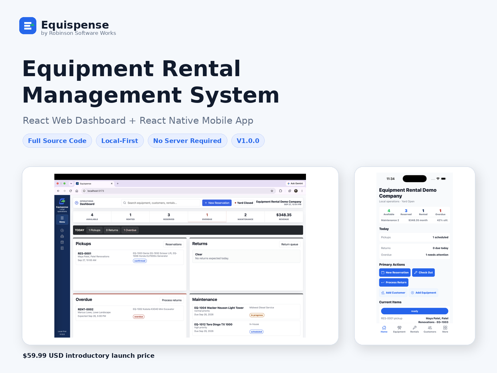
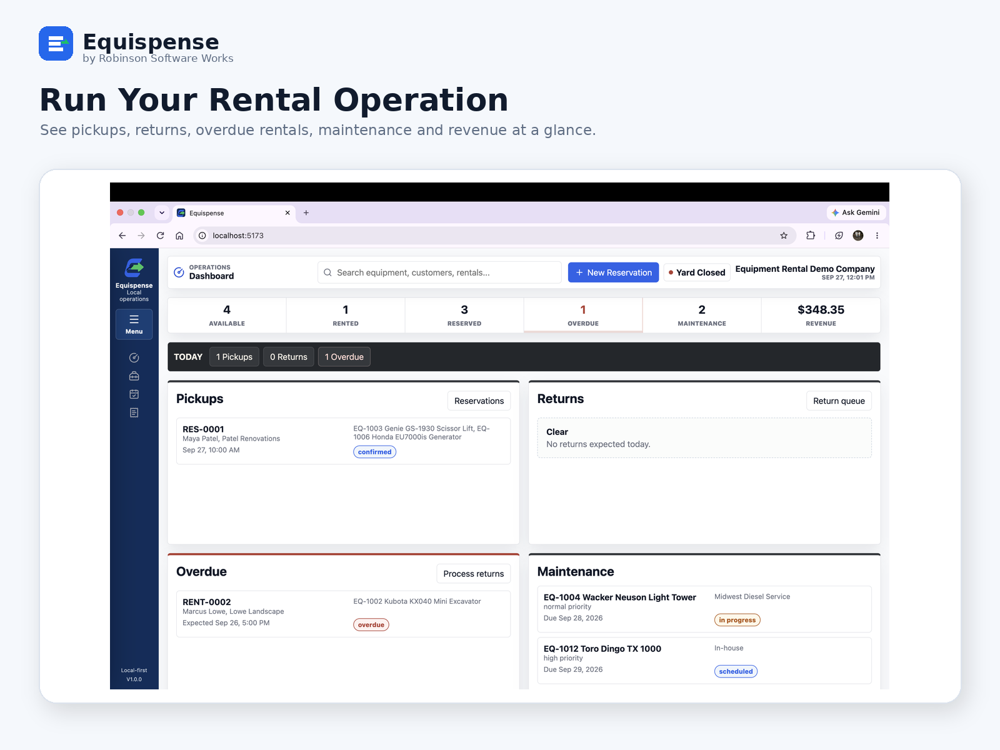
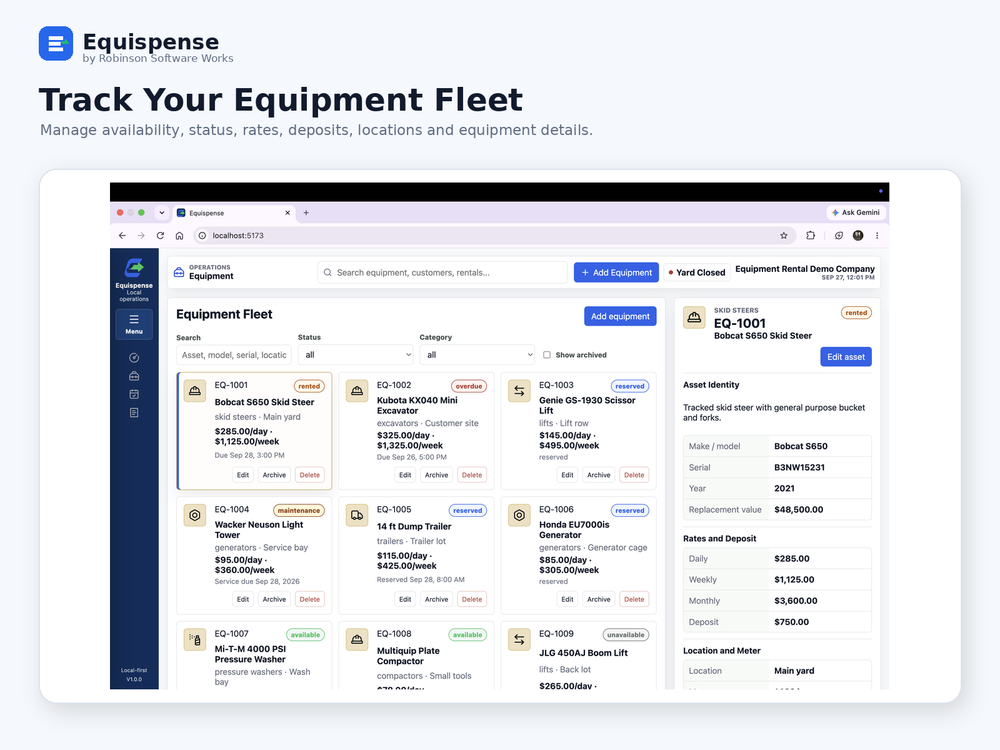
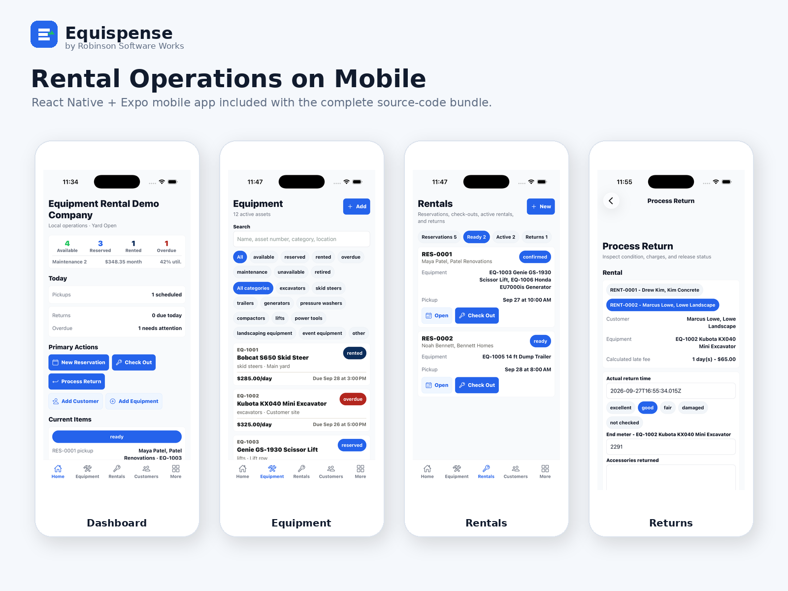
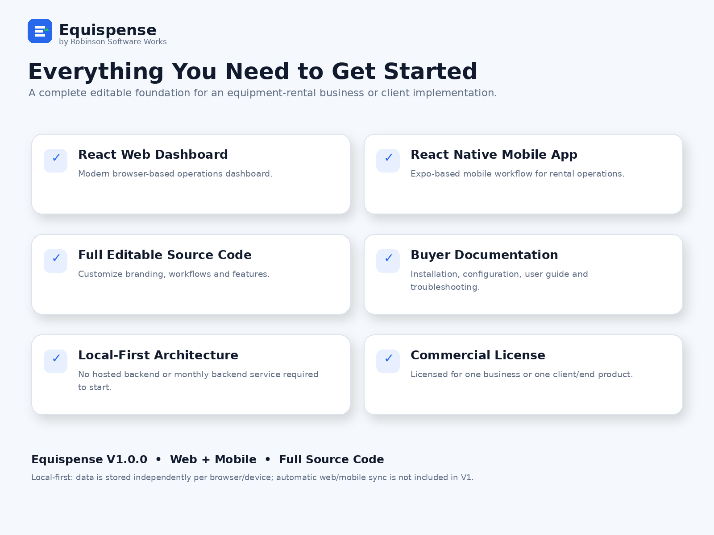

# Equispense

### Equipment Rental Management System

**React Web Dashboard + React Native Mobile App**

Built by **Robinson Software Works**

**Commercial source code • Local-first • No server required to get started**

---

## Overview

Equispense is a complete equipment rental management system designed for businesses that need a practical way to manage day-to-day rental operations.

The product includes a modern **React web dashboard** and **React Native + Expo mobile application**, with full editable source code available commercially.

Equispense covers the rental workflow from reservation through return, including equipment availability, customers, reservations, active rentals, checkout and returns, deposits, fees, invoices, maintenance records, and business reporting.

## Web + Mobile

### Web Dashboard

The web application provides the main operational workspace for managing the rental business, including fleet visibility, availability, customers, reservations, rentals, returns, invoicing, maintenance, and reporting.

### Mobile Application

The React Native mobile application provides a mobile-friendly workflow for accessing equipment, reservations, rentals, returns, invoices, maintenance information, reports, and settings.

## Key Features

- Equipment and inventory management
- Availability tracking
- Customer management
- Reservations and scheduling
- Rental checkout
- Active rental tracking
- Return processing and condition recording
- Deposits, late fees, and damage charges
- Invoice and payment tracking
- Maintenance records and status tracking
- Revenue and operational reporting
- Dashboard metrics and alerts
- Search and filtering
- Local backup, restore, and import/export tools
- Demo data for evaluation
- Full editable commercial source code

## Technology

**Web:** React + Vite  
**Mobile:** React Native + Expo  
**Architecture:** Local-first

Equispense can be installed and used without configuring a server or paid backend service.

## Local-First Architecture

Equispense V1 stores data locally. Data is stored independently on each browser or device, and backup/import-export tools are included.

**Automatic synchronization between the web and mobile applications is not included in V1.**

This approach allows buyers to begin using and customizing the system without first deploying backend infrastructure.

## Product Showcase

### Web Dashboard

### Equipment Management

### Mobile App

### What's Included

## Commercial Source Code

Equispense is a **commercial product**, not an open-source project.

This public repository is a product showcase and portfolio repository. The complete application source code is distributed separately under the Equispense commercial license.

**The paid source code is not contained in this repository.**

### Purchase

**Equispense V1.0.0 — $59.99 USD**

[Buy Equispense — Complete Web + Mobile Source Code](https://robinsonsoftwareworks.lemonsqueezy.com/checkout/buy/6355e21d-1506-4c74-84ed-3c018b0e0e2e)

Secure checkout and digital delivery are provided through Lemon Squeezy.

## License

Copyright © 2026 Robinson Software Works.

All rights reserved.

The Equispense application source code is commercially licensed. Purchase of the product provides usage and modification rights according to the license included with the commercial package. Redistribution, resale, sublicensing, or publication of the source code as another source-code/template product is not permitted.

## Publisher

**Robinson Software Works**  
Practical software for modern businesses.

---

**Equispense V1.0.0**

Equipment Rental Management System

